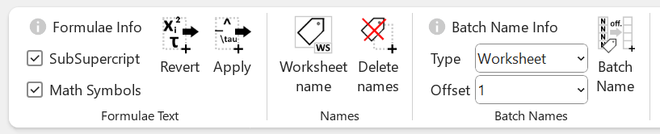

# Excel4Engineers
An Excel toolbar with functions such as writing formulae with mathematical symbols, subscript superscript, naming cells, and creating schedules of pdf drawings.

# How to install

1. Download the zip file in the releases section and unzip to a local folder. 
2. Within Excel, go to Developer Tab > Excel Addins > Browse > ...
3. Select the file Excel4Engineers-AddIn.xll or Excel4Engineers-AddIn64.xll depending on whether your version of excel is 32 bit or 64 bit.

# Features

## Write symbols and sub/superscript
Write mathematical symbols with `\` e.g. `\rho` => `ρ` and subscript (`_`) and superscript (`^`), as shown below

## Name cells
- Create worksheet scope names from the toolbar
- Delete names from selected cells
- Batch name a selection of cells, with Names or worksheet scope Names. 

## Drawing schedule functions
- Create a schedule of drawings in a directory with the a template worksheet

- Copy or rename these files

- Read pdf text from from the titleblock

## Unmerge and merge cells whilst preserving the original text
- Unmerge and duplicate: Unmerges cells, and duplicates the cell text in every cell
- Merge and without delete: Merges cells and joins the constituent text together
